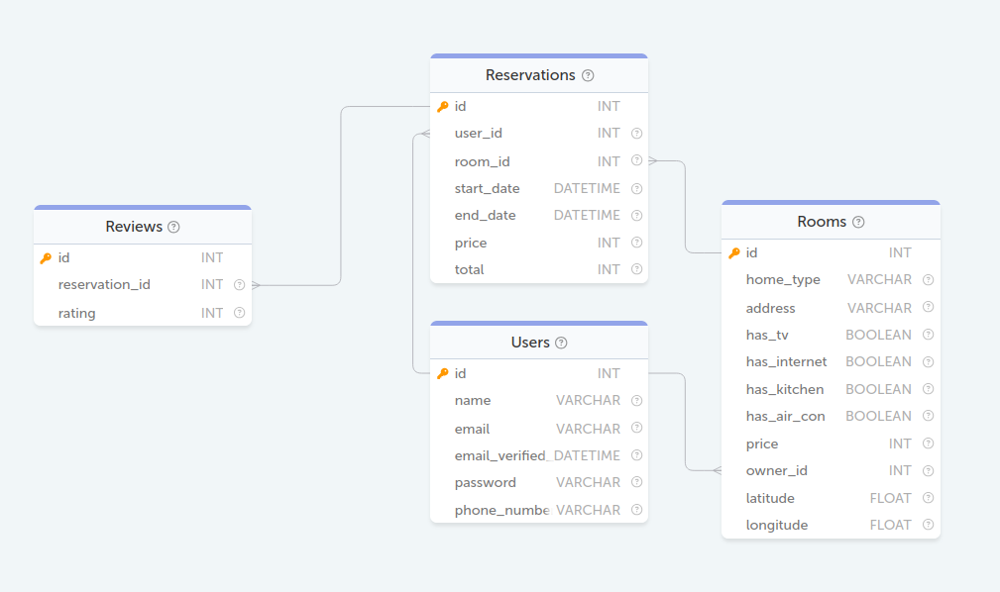

### БД AirBNB
<p align='center'>
    
</p>

#### Задание 58. Добавить отзыв с рейтингом 5 на жилье, находящиеся по адресу "11218, Friel Place, New York", от имени "George Clooney"
```sql
INSERT INTO Reviews
SET id = (
    SELECT COUNT(*) + 1
    FROM Reviews rw
),
    reservation_id = (
        SELECT rs.id
        FROM Reservations rs
                 JOIN Rooms rm ON rm.id = rs.room_id
                 JOIN Users us ON rs.user_id = us.id
        WHERE address = '11218, Friel Place, New York'
          AND name = 'George Clooney'
    ),
    rating = 5;
```

#### Задание 59. Вывести пользователей,указавших Белорусский номер телефона ? Телефонный код Белоруссии +375.
```sql
SELECT * FROM Users WHERE phone_number LIKE '+375%';
```

#### Задание 61. Выведите список комнат, которые были зарезервированы хотя бы на одни сутки в 12-ую неделю 2020 года. В данной задаче в качестве одной недели примите период из семи дней, первый из которых начинается 1 января 2020 года. Например, первая неделя года — 1–7 января, а третья — 15–21 января.
```sql
SELECT Rooms.* 
FROM Rooms 
JOIN Reservations 
ON Rooms.id = Reservations.room_id 
WHERE WEEK(start_date, 1) = 12 
      AND YEAR(start_date) = 2020;
```

#### Задание 62. Вывести в порядке убывания популярности доменные имена 2-го уровня, используемые пользователями для электронной почты. Полученный результат необходимо дополнительно отсортировать по возрастанию названий доменных имён.
```sql
SELECT SUBSTRING_INDEX(email, '@', -1) AS domain,
	COUNT(SUBSTRING_INDEX(email, '@', -1)) AS COUNT
FROM Users
GROUP BY domain
ORDER BY COUNT DESC,
	domain
```

#### Задание 64. Вывести количество бронирований по каждому месяцу каждого года, в которых было хотя бы 1 бронирование. Результат отсортируйте в порядке возрастания даты бронирования.
```sql
SELECT YEAR(start_date) AS year,
	   MONTH(start_date) AS month,
	   COUNT(*) AS amount
FROM Reservations
GROUP BY year, month
ORDER BY year, month;
```

#### Задание 65. Необходимо вывести рейтинг для комнат, которые хоть раз арендовали, как среднее значение рейтинга отзывов округленное до целого вниз.
```sql
SELECT room_id,
	   FLOOR(AVG(rating)) AS rating
FROM Reservations
JOIN Reviews 
ON Reservations.id = Reviews.reservation_id
GROUP BY room_id;
```

#### Задание 66. Вывести список комнат со всеми удобствами (наличие ТВ, интернета, кухни и кондиционера), а также общее количество дней и сумму за все дни аренды каждой из таких комнат.
```sql
SELECT rm.home_type,
       rm.address,
       IFNULL(SUM(total / rs.price), 0) AS days,
       IFNULL(SUM(total), 0) AS total_fee
FROM Rooms rm
LEFT JOIN Reservations rs ON rs.room_id = rm.id
WHERE has_tv = 1
	  AND has_internet = 1
	  AND has_kitchen = 1
	  AND has_air_con = 1
GROUP BY home_type, address;
```

#### Задание 68. Для каждой комнаты, которую снимали как минимум 1 раз, найдите имя человека, снимавшего ее последний раз, и дату, когда он выехал
```sql
SELECT rs.room_id,
       name,
       date AS end_date
FROM (
    SELECT room_id,
		   MAX(end_date) AS date
	FROM Reservations
	GROUP BY room_id
) rs
JOIN Reservations rsv 
ON rs.room_id = rsv.room_id AND rs.date = rsv.end_date
JOIN Users us 
ON rsv.user_id = us.id;
```

#### Задание 69. Вывести идентификаторы всех владельцев комнат, что размещены на сервисе бронирования жилья и сумму, которую они заработали
```sql
SELECT owner_id,
	   IFNULL(SUM(total), 0) AS total_earn
FROM Rooms
LEFT JOIN Reservations 
ON Rooms.id = Reservations.room_id
GROUP BY owner_id
```

#### Задание 70. Необходимо категоризовать жилье на economy, comfort, premium по цене соответственно <= 100, 100 < цена < 200, >= 200. В качестве результата вывести таблицу с названием категории и количеством жилья, попадающего в данную категорию
```sql
SELECT CASE WHEN price <= 100 THEN 'economy'
            WHEN price > 100
                 AND price < 200 THEN 'comfort'
            WHEN price >= 200 THEN 'premium'
            END AS category,
       COUNT(price) AS count
FROM Rooms
GROUP BY category;
```

#### Задание 71. Найдите какой процент пользователей, зарегистрированных на сервисе бронирования, хоть раз арендовали или сдавали в аренду жилье. Результат округлите до сотых.
```sql
SELECT ROUND(
       (SELECT COUNT(*)
		FROM (SELECT DISTINCT owner_id
			  FROM Rooms rm
			  JOIN Reservations rs 
              ON rm.id = rs.room_id
			  UNION
			  SELECT user_id
			  FROM Reservations
		) active_users
	) * 100 / (SELECT COUNT(*)
			   FROM Users
	), 2) AS percent;
```

#### Задание 72. Выведите среднюю цену бронирования за сутки для каждой из комнат, которую бронировали хотя бы один раз. Среднюю цену необходимо округлить до целого значения вверх.
```sql
SELECT room_id,
       CEILING(AVG(price)) AS avg_price
FROM Reservations
GROUP BY room_id;
```

#### Задание 73. Выведите id тех комнат, которые арендовали нечетное количество раз
```sql
SELECT room_id,
       COUNT(*) AS count
FROM Reservations
GROUP BY room_id
HAVING count % 2 != 0;
```

#### Задание 74. Выведите идентификатор и признак наличия интернета в помещении. Если интернет в сдаваемом жилье присутствует, то выведите «YES», иначе «NO».
```sql
SELECT id, 
       IF(has_internet = 1, 'YES', 'NO') AS has_internet 
FROM Rooms;
```

#### Задание 76. Вывести имена всех пользователей сервиса бронирования жилья, а также два признака: является ли пользователь собственником какого-либо жилья (is_owner) и является ли пользователь арендатором (is_tenant). В случае наличия у пользователя признака необходимо вывести в соответствующее поле 1, иначе 0.
```sql
SELECT name, 
       IF(id IN (SELECT owner_id FROM Rooms), 1, 0) AS is_owner,
	   IF(id IN (SELECT user_id FROM Reservations), 1, 0) AS is_tenant
FROM Users;
```

#### Задание 78. Выведите всех пользователей с электронной почтой в «hotmail.com»
```sql
SELECT * FROM Users WHERE email LIKE '%@hotmail.com';
```

#### Задание 79. Выведите поля id, home_type, price у всего жилья из таблицы Rooms. Если комната имеет телевизор и интернет одновременно, то в качестве цены в поле price выведите цену, применив скидку 10%.
```sql
SELECT id, 
       home_type, 
       IF(has_tv AND has_internet, price * .9 , price) AS price 
FROM Rooms;
```

#### Задание 80. Создайте представление «Verified_Users» с полями id, name и email, которое будет показывает только тех пользователей, у которых подтвержден адрес электронной почты.
```sql
CREATE VIEW Verified_Users AS 
SELECT id, name, email 
FROM Users 
WHERE email_verified_at IS NOT NULL;
```
