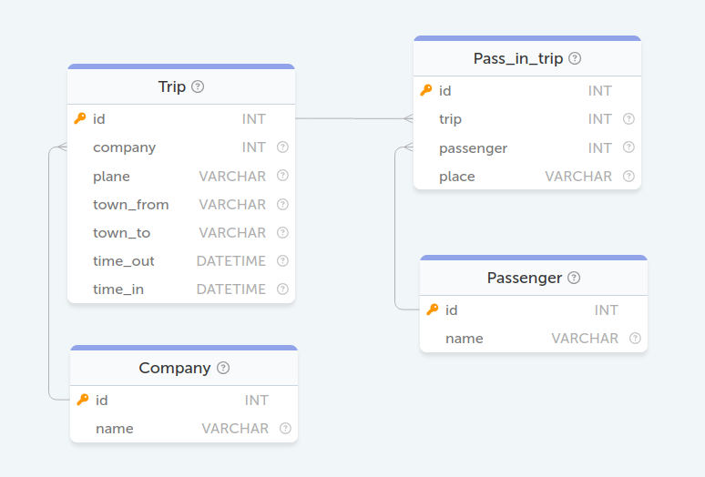

### БД Авиаперелёты
<p align='center'>
    
</p>

#### Задание 1. Вывести имена всех людей, которые есть в базе данных авиакомпаний
```sql
SELECT name FROM Passenger;
```

#### Задание 2. Вывести названия всеx авиакомпаний
```sql
SELECT name FROM Company;
```

#### Задание 3. Вывести все рейсы, совершенные из Москвы
```sql
SELECT * FROM Trip WHERE town_from='Moscow';
```

#### Задание 4. Вывести имена людей, которые заканчиваются на "man"
```sql
SELECT name FROM Passenger WHERE name LIKE '%man';
```

#### Задание 5. Вывести количество рейсов, совершенных на TU-134
```sql
SELECT COUNT(plane) as count FROM Trip WHERE plane = 'TU-134';
```

#### Задание 6. Какие компании совершали перелеты на Boeing
```sql
SELECT DISTINCT name 
FROM Company 
JOIN Trip 
ON Company.id = Trip.company
WHERE plane = 'Boeing';
```

#### Задание 7. Вывести все названия самолётов, на которых можно улететь в Москву (Moscow)
```sql
SELECT DISTINCT plane FROM Trip WHERE town_to = 'Moscow';
```

#### Задание 8. В какие города можно улететь из Парижа (Paris) и сколько времени это займёт?
```sql
SELECT town_to, 
       TIMEDIFF(time_in, time_out) as flight_time 
FROM Trip 
WHERE town_from = 'Paris';
```

#### Задание 9. Какие компании организуют перелеты из Владивостока (Vladivostok)?
```sql
SELECT name 
FROM Company
JOIN Trip 
ON Company.id = Trip.company
WHERE town_from = 'Vladivostok';
```

#### Задание 10. Вывести вылеты, совершенные с 10 ч. по 14 ч. 1 января 1900 г.
```sql
SELECT * 
FROM Trip 
WHERE DATE(time_out) = '1900-01-01' 
      AND TIME_FORMAT(time_out, '%H:%i') >= '10:00'
      AND TIME_FORMAT(time_out, '%H:%i') <= '14:00';
```

#### Задание 11. Выведите пассажиров с самым длинным ФИО. Пробелы, дефисы и точки считаются частью имени.
```sql
SELECT name 
FROM Passenger 
WHERE LENGTH(name) = (SELECT MAX(LENGTH(name)) 
                      FROM Passenger);
```

#### Задание 12. Выведите идентификаторы всех рейсов и количество пассажиров на них. Обратите внимание, что на каких-то рейсах пассажиров может не быть. В этом случае выведите число "0".
```sql
SELECT Trip.id AS id, 
       COUNT(Pass_in_trip.id) AS count 
FROM Trip 
LEFT JOIN Pass_in_trip 
ON Trip.id = Pass_in_trip.trip 
GROUP BY Trip.id;
```

#### Задание 13. Вывести имена людей, у которых есть полный тёзка среди пассажиров
```sql
SELECT name 
FROM Passenger 
GROUP BY name 
HAVING COUNT(*) > 1;
```

#### Задание 14. В какие города летал Bruce Willis
```sql
SELECT Trip.town_to 
FROM Trip 
JOIN Pass_in_trip 
ON Trip.id = Pass_in_trip.trip 
JOIN Passenger 
ON Pass_in_trip.passenger = Passenger.id 
WHERE Passenger.name = 'Bruce Willis';
```

#### Задание 15. Выведите идентификатор пассажира Стив Мартин (Steve Martin) и дату и время его прилёта в Лондон (London)
```sql
SELECT Pass_in_trip.passenger as id, 
       Trip.time_in 
FROM Pass_in_trip 
JOIN Trip 
ON Pass_in_trip.trip = Trip.id
JOIN  Passenger 
ON Pass_in_trip.passenger = Passenger.id 
WHERE Passenger.name = 'Steve Martin' 
      AND Trip.town_to = 'London';
```

#### Задание 16. Вывести отсортированный по количеству перелетов (по убыванию) и имени (по возрастанию) список пассажиров, совершивших хотя бы 1 полет.
```sql
SELECT name, 
       COUNT(name) as count 
FROM Passenger 
JOIN Pass_in_trip 
ON Passenger.id = Pass_in_trip.passenger 
JOIN Trip 
ON Pass_in_trip.trip = Trip.id 
GROUP BY name 
ORDER BY count DESC, 
         name ASC;
```

#### Задание 28. Сколько рейсов совершили авиакомпании из Ростова (Rostov) в Москву (Moscow)?
```sql
SELECT COUNT(*) as count 
FROM Trip 
WHERE town_from = 'Rostov' 
      AND town_to = 'Moscow';
```

#### Задание 29. Выведите имена пассажиров улетевших в Москву (Moscow) на самолете TU-134. В ответе не должно быть дубликатов.
```sql
SELECT DISTINCT Passenger.name 
FROM Passenger
LEFT JOIN Pass_in_trip 
ON Passenger.id = Pass_in_trip.passenger 
LEFT JOIN Trip 
ON Pass_in_trip.trip = Trip.id 
WHERE town_to = 'Moscow' 
      AND plane = 'TU-134';
```

#### Задание 30. Выведите нагруженность (число пассажиров) каждого рейса (trip). Результат вывести в отсортированном виде по убыванию нагруженности.
```sql
SELECT trip, 
       COUNT(passenger) as count 
FROM Pass_in_trip 
GROUP BY trip 
ORDER BY count DESC;
```

#### Задание 55. Удалить компании, совершившие наименьшее количество рейсов.
```sql
DELETE FROM Company 
WHERE id in (
    SELECT company 
    FROM Trip 
    GROUP BY company 
    HAVING COUNT(*) = (
        SELECT COUNT(*) AS count 
        FROM Trip 
        GROUP BY company 
        ORDER BY count ASC 
        LIMIT 1
        )
    );
```

#### Задание 56. Удалить все перелеты, совершенные из Москвы (Moscow).
```sql
DELETE FROM Trip WHERE town_from = 'Moscow';
```

#### Задание 67. Вывести время отлета и время прилета для каждого перелета в формате "ЧЧ:ММ, ДД.ММ - ЧЧ:ММ, ДД.ММ", где часы и минуты с ведущим нулем, а день и месяц без.
```sql
SELECT CONCAT(
              DATE_FORMAT(time_out, '%H:%i, %e.%c'), 
              ' - ', 
              DATE_FORMAT(time_in, '%H:%i, %e.%c')) AS flight_time 
FROM Trip
```
