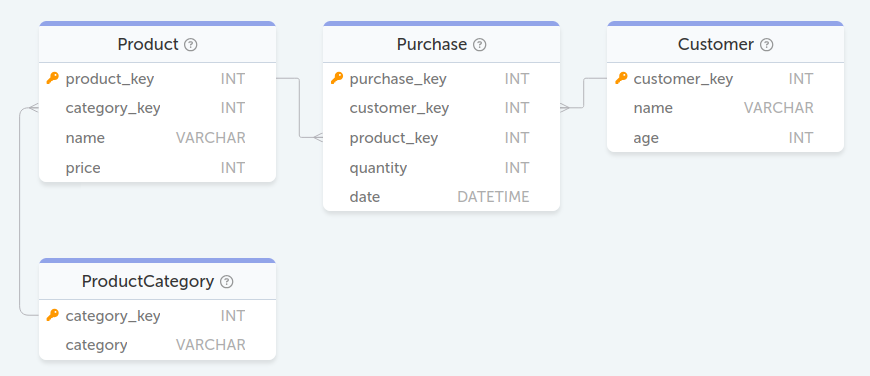
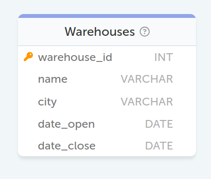
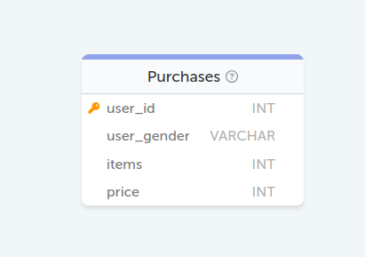
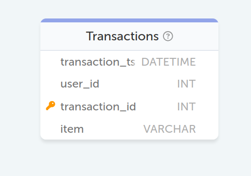
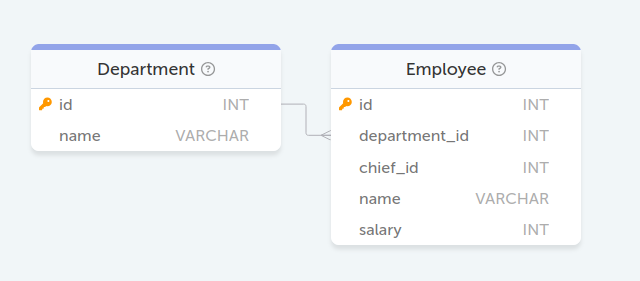
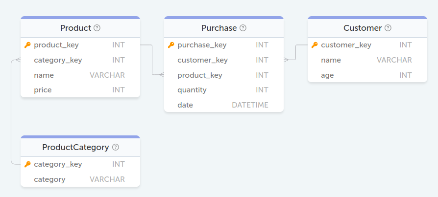
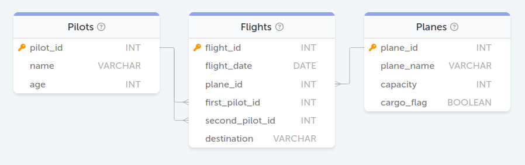

### БД Тестовое задание Альфа банк
<p align='center'>
    
</p>

#### Задание 93. Какой средний возраст клиентов, купивших Smartwatch (использовать наименование товара product.name) в 2024 году?
```sql
SELECT AVG(unique_customers.age) AS average_age FROM (
    SELECT DISTINCT Customer.customer_key, 
           Customer.age
    FROM Purchase
    JOIN Customer 
    ON Purchase.customer_key = Customer.customer_key
    JOIN Product 
    ON Purchase.product_key = Product.product_key
    WHERE YEAR(Purchase.date) = 2024 
          AND Product.name = 'Smartwatch'
) AS unique_customers
```

#### Задание 94. Вывести имена покупателей, каждый из которых приобрёл Laptop и Monitor (использовать наименование товара product.name) в марте 2024 года?
```sql
SELECT Customer.name AS name
FROM Purchase
JOIN Product 
ON Purchase.product_key = Product.product_key
JOIN Customer 
ON Purchase.customer_key = Customer.customer_key
WHERE Product.name IN ('Laptop', 'Monitor')
	  AND YEAR(Purchase.date) = 2024
	  AND MONTH(Purchase.date) = 3
GROUP BY Customer.customer_key
HAVING COUNT(DISTINCT Product.name) = 2
```

### БД Тестовое задание Самокат
<p align='center'>
    
</p>

#### Задание 97. Посчитать количество работающих складов на текущую дату по каждому городу. Вывести только те города, у которых количество складов более 80. Данные на выходе - город, количество складов.
```sql
SELECT city,
	COUNT(city) AS warehouse_count
FROM Warehouses
WHERE date_close IS NULL
GROUP BY city
HAVING COUNT(city) > 80
```

### БД Тестовое задание VK
<p align='center'>
    
</p>

#### Задание 99. Посчитай доход с женской аудитории (доход = сумма(price * items)). Обратите внимание, что в таблице женская аудитория имеет поле user_gender «female» или «f».
```sql
SELECT SUM(items * price) AS income_from_female 
FROM Purchases 
WHERE user_gender LIKE 'f%';
```

<p align='center'>
    
</p>

#### Задание 101. Выведи для каждого пользователя первое наименование, которое он заказал (первое по времени транзакции).
```sql
SELECT t1.user_id, t1.item
FROM Transactions t1
JOIN (
      SELECT user_id, MIN(transaction_ts) as min_time
      FROM Transactions
      GROUP BY user_id
) t2
ON t1.user_id = t2.user_id AND t1.transaction_ts = t2.min_time;
```

### БД Тестовое задание Сбербанк
<p align='center'>
    
</p>

#### Задание 103. Вывести список имён сотрудников, получающих большую заработную плату, чем у непосредственного руководителя.
```sql
SELECT employees.name
FROM Employee AS employees,
	 Employee AS chieves
WHERE chieves.id = employees.chief_id
	  AND employees.salary > chieves.salary;
```

### БД Тестовое задание ДомКлик
<p align='center'>
    
</p>

#### Задание 109. Выведите название страны, где находится город «Salzburg»
```sql
SELECT Countries.name AS country_name 
FROM Countries 
JOIN Regions 
ON Countries.id = Regions.countryid 
JOIN Cities 
ON Regions.id = Cities.regionid 
WHERE Cities.name = 'Salzburg';
```

#### Задание 111. Посчитайте население каждого региона. В качестве результата выведите название региона и его численность населения.
```sql
SELECT Regions.name AS region_name, 
       SUM(Cities.population) as total_population 
FROM Cities 
LEFT JOIN Regions 
ON Cities.regionid = Regions.id 
GROUP BY Regions.name;
```

### БД Тестовое задание ТБанк
<p align='center'>
    
</p>

#### Задание 114. Напишите запрос, который выведет имена пилотов, которые в качестве второго пилота (second_pilot_id) в августе 2023 года летали в New York
```sql
SELECT DISTINCT name 
FROM Pilots 
JOIN Flights 
ON Flights.second_pilot_id = Pilots.pilot_id 
WHERE destination = 'New York' 
      AND YEAR(flight_date) = 2023 
      AND MONTH(flight_date) = 8;
```
