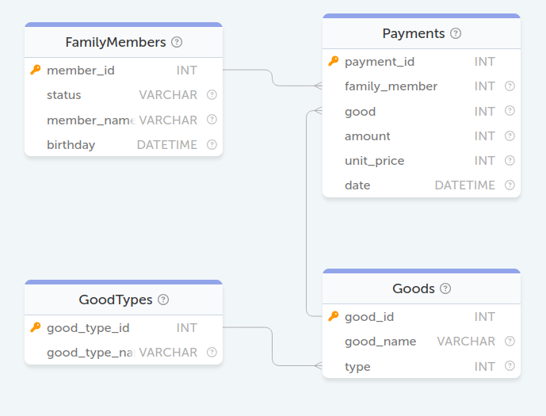

### БД Семья
<p align='center'>
    
</p>

#### Задание 17. Определить, сколько потратил в 2005 году каждый из членов семьи. В результирующей выборке не выводите тех членов семьи, которые ничего не потратили.
```sql
SELECT member_name, 
       status, 
       SUM(unit_price * amount) as costs 
FROM FamilyMembers 
JOIN Payments 
ON Payments.family_member = FamilyMembers.member_id 
WHERE YEAR(date) = '2005' 
GROUP BY member_name, 
         status;
```

#### Задание 18. Выведите имя самого старшего человека. Если таких несколько, то выведите их всех.
```sql
SELECT member_name FROM FamilyMembers ORDER BY birthday ASC LIMIT 1;
```

#### Задание 19. Определить, кто из членов семьи покупал картошку (potato)
```sql
SELECT DISTINCT status 
FROM FamilyMembers 
JOIN Payments 
ON FamilyMembers.member_id = Payments.family_member 
JOIN Goods ON Payments.good = Goods.good_id 
WHERE Goods.good_name = 'potato';
```

#### Задание 20. Сколько и кто из семьи потратил на развлечения (entertainment). Вывести статус в семье, имя, сумму
```sql
SELECT status, 
       member_name, 
       SUM(unit_price * amount) as costs 
FROM FamilyMembers 
JOIN Payments 
ON FamilyMembers.member_id = Payments.family_member 
JOIN Goods 
ON Payments.good = Goods.good_id 
JOIN GoodTypes 
ON Goods.type = GoodTypes.good_type_id 
WHERE GoodTypes.good_type_name = 'entertainment' 
GROUP BY status, 
         member_name;
```

#### Задание 21. Определить товары, которые покупали более 1 раза
```sql
SELECT good_name 
FROM Goods 
JOIN Payments 
ON Goods.good_id = Payments.good 
GROUP BY good_name 
HAVING COUNT(*) > 1;
```

#### Задание 22. Найти имена всех матерей (mother)
```sql
SELECT member_name FROM FamilyMembers WHERE status = 'mother';
```

#### Задание 23. Найдите самый дорогой деликатес (delicacies) и выведите его цену
```sql
SELECT good_name, 
       unit_price 
FROM Payments 
JOIN Goods 
ON Payments.good = Goods.good_id 
JOIN GoodTypes 
ON Goods.type = GoodTypes.good_type_id 
WHERE GoodTypes.good_type_name = 'delicacies' 
LIMIT 1;
```

#### Задание 24. Определить кто и сколько потратил в июне 2005
```sql
SELECT member_name, 
       SUM(amount * unit_price) as costs 
FROM FamilyMembers 
JOIN Payments 
ON FamilyMembers.member_id = Payments.family_member 
WHERE YEAR(date) = 2005 
      AND MONTH(date) = 6 
GROUP BY member_name;
```

#### Задание 25. Определить, какие товары не покупались в 2005 году
```sql
SELECT good_name 
FROM Goods 
LEFT JOIN Payments 
ON Goods.good_id = Payments.good 
   AND YEAR(Payments.date) = 2005
WHERE Payments.good IS NULL;
```

#### Задание 26. Определить группы товаров, которые не приобретались в 2005 году
```sql
SELECT good_type_name 
FROM GoodTypes 
LEFT JOIN Goods 
ON GoodTypes.good_type_id = Goods.type 
LEFT JOIN Payments 
ON Goods.good_id = Payments.good 
   AND YEAR(Payments.date) = 2005 
GROUP BY good_type_id,
         good_type_name 
HAVING COUNT(Payments.good) = 0;
```

#### Задание 27. Узнайте, сколько было потрачено на каждую из групп товаров в 2005 году. Выведите название группы и потраченную на неё сумму. Если потраченная сумма равна нулю, т.е. товары из этой группы не покупались в 2005 году, то не выводите её.
```sql
SELECT good_type_name, 
       SUM(Payments.amount * Payments.unit_price) as costs
FROM GoodTypes 
JOIN Goods 
ON GoodTypes.good_type_id = Goods.type 
JOIN Payments 
ON Goods.good_id = Payments.good 
   AND YEAR(Payments.date) = 2005 
GROUP BY good_type_name;
```

#### Задание 31. Вывести всех членов семьи с фамилией Quincey.
```sql
SELECT * FROM FamilyMembers WHERE member_name LIKE '% Quincey';
```

#### Задание 32. Вывести средний возраст людей (в годах), хранящихся в базе данных. Результат округлите до целого в меньшую сторону.
```sql
SELECT FLOOR(AVG(TIMESTAMPDIFF(YEAR, birthday, CURDATE()))) as age 
FROM FamilyMembers;
```

#### Задание 33. Найдите среднюю цену икры на основе данных, хранящихся в таблице Payments. В базе данных хранятся данные о покупках красной (red caviar) и черной икры (black caviar). В ответе должна быть одна строка со средней ценой всей купленной когда-либо икры.
```sql
SELECT AVG(unit_price) AS cost 
FROM Payments 
JOIN Goods 
ON Payments.good = Goods.good_id 
WHERE Goods.good_name = 'red caviar' 
      OR Goods.good_name = 'black caviar';
```

#### Задание 51. Добавьте товар с именем "Cheese" и типом "food" в список товаров (Goods).
```sql
INSERT INTO Goods 
SET good_id = (SELECT COUNT(*) + 1 FROM Goods AS gs), 
    good_name = 'Cheese', 
    type = (
        SELECT good_type_id 
        FROM GoodTypes 
        WHERE good_type_name = 'food'
    );
```

#### Задание 52. Добавьте в список типов товаров (GoodTypes) новый тип "auto".
```sql
INSERT INTO GoodTypes 
SET good_type_id = (
        SELECT COUNT(good_type_id) + 1 
        FROM GoodTypes AS gt), 
    good_type_name = 'auto';
```

#### Задание 53. Измените имя "Andie Quincey" на новое "Andie Anthony".
```sql
UPDATE FamilyMembers 
SET member_name = 'Andie Anthony' 
WHERE member_name = 'Andie Quincey';
```

#### Задание 54. Удалить всех членов семьи с фамилией "Quincey".
```sql
DELETE FROM FamilyMembers 
WHERE member_name 
LIKE '%Quincey';
```
