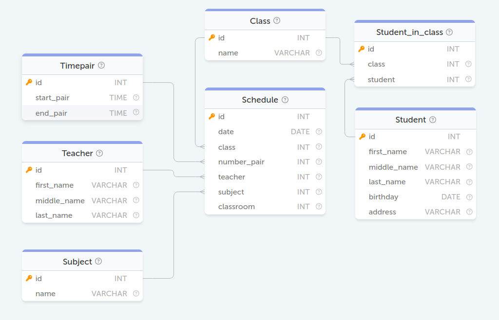

### БД Расписание
<p align='center'>
    
</p>

#### Задание 34. Сколько всего 10-ых классов
```sql
SELECT COUNT(name) AS count FROM Class WHERE name LIKE '10 %';
```

#### Задание 35. Сколько различных кабинетов школы использовались 2 сентября 2019 года для проведения занятий?
```sql
SELECT COUNT(DISTINCT classroom) as count 
FROM Schedule 
WHERE DATE_FORMAT(date, '%Y-%m-%d') = '2019-09-02';
```

#### Задание 36. Выведите информацию об обучающихся живущих на улице Пушкина (ul. Pushkina)?
```sql
SELECT * FROM Student WHERE address LIKE 'ul. Pushkina%';
```

#### Задание 37. Сколько лет самому молодому обучающемуся ?
```sql
SELECT MIN(TIMESTAMPDIFF(YEAR, birthday, CURDATE())) as year 
FROM Student;
```

#### Задание 38. Сколько Анн (Anna) учится в школе?
```sql
SELECT COUNT(first_name) as count 
FROM Student 
WHERE first_name = 'Anna';
```

#### Задание 39. Сколько обучающихся в 10 B классе?
```sql
SELECT COUNT(Student_in_class.class) as count 
FROM Student_in_class 
JOIN Class 
ON Student_in_class.class = Class.id 
WHERE Class.name = '10 B';
```

#### Задание 40. Выведите название предметов, которые преподает Ромашкин П.П. (Romashkin P.P.). Обратите внимание, что в базе данных есть несколько учителей с такой фамилией.
```sql
SELECT Subject.name as subjects 
FROM Subject 
JOIN Schedule 
ON Subject.id = Schedule.subject 
JOIN Teacher 
ON Schedule.teacher = Teacher.id 
WHERE last_name = 'Romashkin' 
      AND first_name LIKE 'P%' 
      AND middle_name LIKE 'P%';
```

#### Задание 41. Выясните, во сколько по расписанию начинается четвёртое занятие.
```sql
SELECT start_pair FROM Timepair WHERE id = '4';
```

#### Задание 42. Сколько времени обучающийся будет находиться в школе, учась со 2-го по 4-ый уч. предмет?
```sql
SELECT TIMEDIFF(MAX(end_pair), MIN(start_pair)) as time 
FROM Timepair 
WHERE id BETWEEN 2 AND 4;
```

#### Задание 43. Выведите фамилии преподавателей, которые ведут физическую культуру (Physical Culture). Отсортируйте преподавателей по фамилии в алфавитном порядке.
```sql
SELECT Teacher.last_name 
FROM Teacher 
JOIN Schedule 
ON Teacher.id = Schedule.teacher 
JOIN Subject 
ON Schedule.subject = Subject.id 
WHERE Subject.name = 'Physical Culture' 
GROUP BY Teacher.last_name 
ORDER BY Teacher.last_name ASC;
```

#### Задание 44. Найдите максимальный возраст (количество лет) среди обучающихся 10 классов на сегодняшний день. Для получения текущих даты и времени используйте функцию NOW().
```sql
SELECT MAX(TIMESTAMPDIFF(YEAR, birthday, NOW())) as max_year 
FROM Student 
JOIN Student_in_class 
ON Student.id = Student_in_class.class 
JOIN Class 
ON Student_in_class.class = Class.id 
WHERE Class.name LIKE '10%';
```

#### Задание 45. Какие кабинеты чаще всего использовались для проведения занятий? Выведите те, которые использовались максимальное количество раз.
```sql
SELECT classroom 
FROM Schedule 
GROUP BY classroom 
HAVING COUNT(classroom) = (
    SELECT COUNT(*) as count 
    FROM Schedule 
    GROUP BY classroom 
    ORDER BY count DESC 
    LIMIT 1
);
```

#### Задание 46. В каких классах введет занятия преподаватель "Krauze"?
```sql
SELECT DISTINCT Class.name 
FROM Class 
JOIN Schedule 
ON Class.id = Schedule.class 
JOIN Teacher 
ON Schedule.teacher = Teacher.id 
WHERE Teacher.last_name = 'Krauze';
```

#### Задание 47. Сколько занятий провел Krauze 30 августа 2019 г.?
```sql
SELECT COUNT(number_pair) as count 
FROM Schedule 
JOIN Teacher 
ON Schedule.teacher = Teacher.id 
WHERE Teacher.last_name = 'Krauze' 
      AND DATE_FORMAT(Schedule.date, '%Y-%m-%d') = '2019-08-30';
```

#### Задание 48. Выведите заполненность классов в порядке убывания
```sql
SELECT Class.name, COUNT(Student_in_class.student) as count 
FROM Class 
JOIN Student_in_class 
ON Class.id = Student_in_class.class 
GROUP BY Class.name 
ORDER BY count DESC;
```

#### Задание 49. Какой процент обучающихся учится в "10 A" классе? Выведите ответ в диапазоне от 0 до 100 с округлением до четырёх знаков после запятой, например, 96.0201.
```sql
SELECT COUNT(*) * 100 / (
    SELECT COUNT(*) 
    FROM Student_in_class) AS percent 
FROM Student_in_class 
JOIN Class 
ON Student_in_class.class = Class.id 
WHERE Class.name = '10 A';
```

#### Задание 50. Какой процент обучающихся родился в 2000 году? Результат округлить до целого в меньшую сторону.
```sql
SELECT FLOOR(COUNT(*) * 100 / (
    SELECT COUNT(*) 
    FROM Student)) AS percent
FROM Student 
WHERE YEAR(birthday) = 2000;
```

#### Задание 57. Перенести расписание всех занятий на 30 мин. вперед.
```sql
UPDATE Timepair 
SET start_pair = ADDTIME(start_pair, '00:30:00'), 
    end_pair = ADDTIME(end_pair, '00:30:00');
```

#### Задание 60. Выведите идентификаторы преподавателей, которые хотя бы один раз за всё время преподавали в каждом из одиннадцатых классов.
```sql
SELECT teacher 
FROM Schedule 
JOIN Class 
ON Schedule.class = Class.id 
WHERE Class.name LIKE '11%'  
GROUP BY teacher 
HAVING COUNT(DISTINCT Class.name) = 2;
```

#### Задание 63. Выведите отсортированный список (по возрастанию) фамилий и имен студентов в виде Фамилия.И.
```sql
SELECT CONCAT(last_name, '.', LEFT(first_name, 1), '.') AS name 
FROM Student 
ORDER BY name ASC;
```

#### Задание 75. Выведите фамилию, имя и дату рождения студентов, кто был рожден в мае.
```sql
SELECT last_name, first_name, birthday 
FROM Student 
WHERE MONTH(birthday) = 5;
```

#### Задание 77. Создайте представление с именем "People", которое будет содержать список имен (first_name) и фамилий (last_name) всех студентов (Student) и преподавателей(Teacher)
```sql
CREATE VIEW People as 
       SELECT first_name, last_name 
       FROM Student 
    UNION 
       SELECT first_name, last_name 
       FROM Teacher
```
